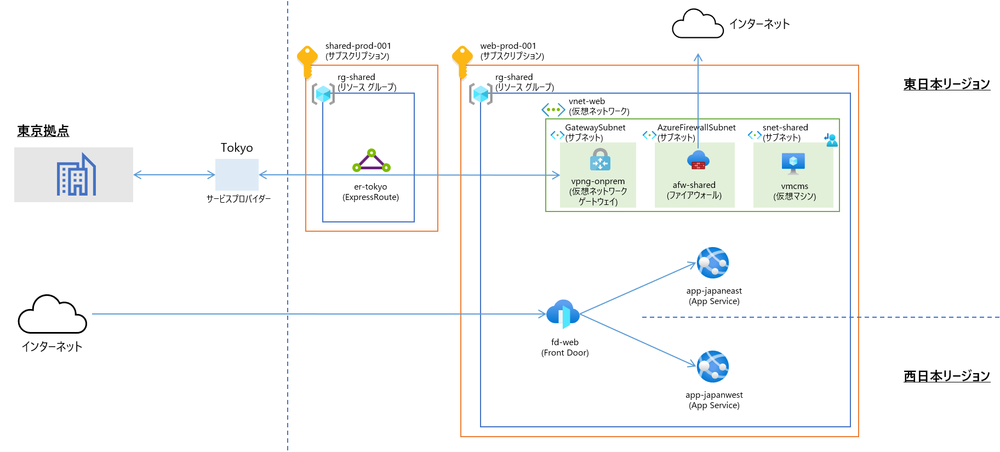

# 4. ネットワークアーキテクチャー事例

本章ではよくあるネットワークのアーキテクチャーとしていくつか例を紹介します。

ネットワークのアーキテクチャーを検討する際、始めに以下のような最低限の要件をまとめることをお勧めします。

- ワークロード
- コンポーネント間の通信要件
- Azure に移行する対象

次に、前章で紹介したトポロジと接続、セキュリティ、リソース構成を意識しながら設計します。

これから紹介する事例でも上記ポイントを意識しながらまとめてみましたので参考にしてみてください。

## シナリオ : Web サーバーの Azure への移行

インターネットからのアクセスが必要な Web サーバーを Web Apps へ移行します。

### ワークロードの概要

- Web サーバーでは企業の Web サイトがホストされています
- CMS サーバーから Web サーバーに対してコンテンツを FTP で配信します
- 一般ユーザーは CMS サーバーにオンプレミスからブラウザ経由(HTTP) でアクセスします
- 管理者ユーザーは SSH(22 番ポート) で各サーバーにアクセスします

### 要件

- 東西日本で冗長構成・負荷分散ができるようにします
- インターネットから接続される Web サーバーと、それらのサーバーを管理する管理用のサーバー(CMS)が存在します
- Web サーバーと CMS のサーバー間(東西間)の通信は一方向(CMS サーバー→Web サーバー)です
- CMS サーバーは OS の更新やミドルウェアの更新のためにインターネットへの接続が必要です
- それぞれのサーバーへはオンプレミスの環境から接続する必要があります

### 設計のポイント

- トポロジ と 接続方法
  - インターネットとの接続(南北間の通信)は Front Door を利用します
    - 東西冗長・負荷分散のために、バックエンドとして東西の Web Apps を設定します
  - オンプレミスネットワークとの接続は ExpressRoute のプライベートピアリングを使用します
  - Web サーバーとして App Service を利用します
    - App Service へのデプロイは FTP を利用します
    - App Service の言語は PHP を利用します
    - 特定の Front Door からの通信をロックダウンするために、Web Apps のアクセス制限で Front Door のサービス タグを利用して許可します
- セキュリティ
  - Front Door で Web Applicaion Framework(WAF) を利用します
  - サービスを提供する東西間の通信(Web サーバーと管理用のサーバー)は Azure Firewall を利用して制御します
  - CMS サーバーからの発信は Azure Firewall を通過させ、インターネットへの通信を制御します
    - App Service への FTP 通信についても Azure Firewall を利用します
  - Front Door で診断ログを有効にし、アクセス状況を追跡できるようにします
  - NSG フロー ログを有効にしてネットワークフローを監視します
- リソース構成
  - 2 つのサブスクリプションを作成し、それぞれ共有リソースと Web サービスのリソースを配置します
    - 共有リソース用のサブスクリプションには、ExpressRoute 回線、VPN Gateway を配置します
    - Web サービス用のサブスクリプションには、Azure Firewall、CMS サーバー、Front Door、App Service を配置します

### 移行時のポイント

- DNS の切り替えに時間がかかることを考慮しあらかじめ TTL を短くしておきます
- SSL のプロトコルの変更によるアクセス不可に備えて事前のテストと移行時のモニタリングをします
- 既存環境のモニタリングを行いアクセスがなくなったタイミングでシャットダウンします
- エンドポイントに既存環境と App Service を設定して重みを付け、通信の割合を徐々に App Service に増やしていきます

### 改善できるポイント

- App Service の送信接続に Azure Firewall を導入できます
- App Service のデプロイに FTP 以外の方法を導入できます
- Front Door と App Service の通信をロックダウンするために Front Door Premium SKU のプライベート エンドポイントが利用できます

## そのほかのシナリオ

- [マルチリージョン n 層アプリケーション](https://docs.microsoft.com/ja-jp/azure/architecture/reference-architectures/n-tier/multi-region-sql-server)
- [Traffic Manager と Application Gateway を使用したマルチリージョンの負荷分散](https://docs.microsoft.com/ja-jp/azure/architecture/high-availability/reference-architecture-traffic-manager-application-gateway)
- [HA/DR 用に構築された多階層 Web アプリケーション](https://docs.microsoft.com/ja-jp/azure/architecture/example-scenario/infrastructure/multi-tier-app-disaster-recovery)
- [Azure のマルチテナント SaaS](https://docs.microsoft.com/ja-jp/azure/architecture/example-scenario/multi-saas/multitenant-saas)
- [PaaS データストアへのプライベート接続を使用したネットワーク強化 Web アプリケーション](https://docs.microsoft.com/ja-jp/azure/architecture/example-scenario/security/hardened-web-app)
- [Azure Kubernetes Service (AKS) クラスターのベースライン アーキテクチャ](https://docs.microsoft.com/ja-jp/azure/architecture/reference-architectures/containers/aks/secure-baseline-aks)
- [コアなスタートアップ スタックのアーキテクチャ](https://docs.microsoft.com/ja-jp/azure/architecture/example-scenario/startups/core-startup-stack)
- [Azure SQL Database への Web アプリのプライベート接続](https://docs.microsoft.com/ja-jp/azure/architecture/example-scenario/private-web-app/private-web-app)
- [Azure API Management と Azure AD B2C を使用してバックエンド API を保護する](https://docs.microsoft.com/ja-jp/azure/architecture/solution-ideas/articles/protect-backend-apis-azure-management)
- [データベースへのプライベート接続を使用したマルチリージョン Web アプリ](https://docs.microsoft.com/ja-jp/azure/architecture/example-scenario/sql-failover/app-service-private-sql-multi-region)
- [オンプレミス ネットワークからマルチテナント Web アプリへの強化セキュリティ アクセス](https://docs.microsoft.com/ja-jp/azure/architecture/example-scenario/security/access-multitenant-web-app-from-on-premises)
